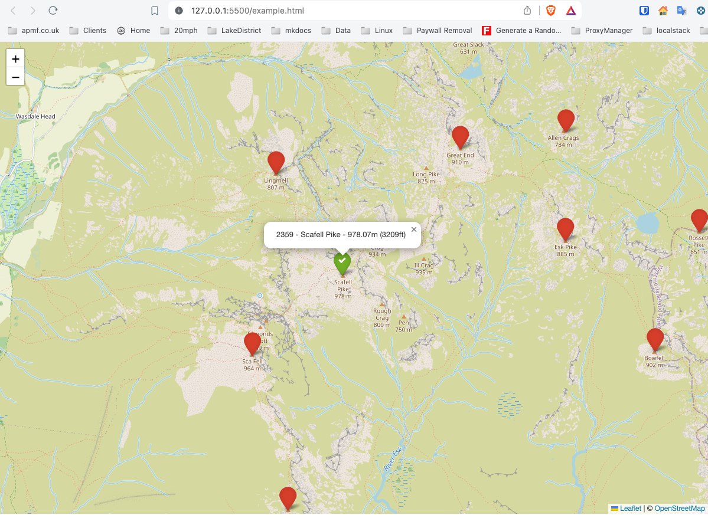

# wainwrights
Mapping wainwrights on openstreetmap using leafletjs

example.html provides a basic page that displays a map (centered on Scarfell Pike)

The marker data is supplied from server.py microservice with a sqlite DB backend.

Future plans:

- Use better DB (MySQL or PostgreSQL) - will support better throughput
- Containerise the microservice with a suitable server process for Flask

- Extend the database of Wainwrights to cover more hills in UK

- Put 'climbed' details in a separate table