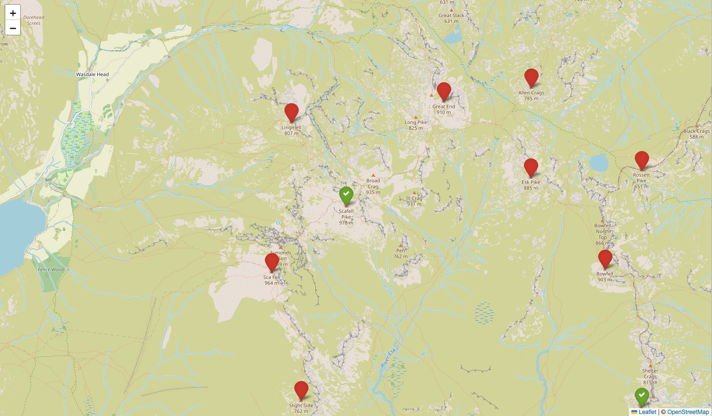

# wainwrights

Mapping Wainwrights on openstreetmap using leafletjs

`wainwrights.html` provides a basic page that displays a map centered on Scafell Pike. Green tick markers indicate Wainwrights that have been climbed.

Current version: `1.0.0`

The marker data is supplied from server.py microservice with a sqlite DB backend.

By default the map shows the read-only climb state from `wainwrights.db`. You can also share a user-specific view with a URL such as `http://127.0.0.1:5000/?user=ajpowell`, which shows that user's climbed Wainwrights and notes in read-only mode unless the browser is authenticated as the same user.

Use the local login panel to create or sign in to a user account; the browser will keep you signed in for 90 days unless you log out.

Authenticated users can export their climbed list as CSV and import CSV updates back into their own account. Imports merge rows by `wainwright_id`, warn when changing an existing climb, and only store climbed entries. The current view panel also includes a small share-link control that copies the URL for the view being shown.

The default map view is centered on `54.499914, -3.095534` at zoom level `11`.

When running in Docker, the user database is written to `/data/wainwrights_users.db` by default. Mount that directory to persist user accounts and climbs outside the container. The share link is generated from the browser URL, so behind a reverse proxy it should resolve to the public proxy address rather than the container's internal address, as long as users access the app through the proxy.

The container uses Gunicorn with configurable settings:

- `WEB_CONCURRENCY` defaults to `1`
- `GUNICORN_THREADS` defaults to `2`
- `GUNICORN_TIMEOUT` defaults to `60`

Those defaults keep the memory footprint small on a 1 GB VPS, but you can increase them in `docker run` or Compose if needed.

For Compose, copy `.env.example` to `.env` and adjust the values there. Compose will load `.env` automatically.

## Usage - casual usage:

 - From a terminal, start venv:
    
    `python3 -m venv .venv`

 - Activate the venv:

    `. ./.venv/bin/activate`

 - Install the requirements:
 
    `pip install -r requirements.txt`

 - Start the microservice (wainwrights api):
 
    `python server.py`

- Open `http://127.0.0.1:5000/` in a browser

## Container usage

- Build the image:

  `docker build -t localhost/wainwrights:latest .`

- Run the container with a persisted user database:

  `docker run -d --rm -p 5000:5000 -v ./data:/data --name wainwrights localhost/wainwrights:latest`

  Example with explicit Gunicorn settings:

  `docker run -d --rm -p 5000:5000 -v ./data:/data -e WEB_CONCURRENCY=2 -e GUNICORN_THREADS=2 -e GUNICORN_TIMEOUT=60 --name wainwrights localhost/wainwrights:latest`

- Or use Compose:

  `docker compose up --build`

  Optional first step:

  `cp .env.example .env`

  Compose tags the local image as `localhost/wainwrights:latest`.

## Future plans/intentions:

- Use better DB (MySQL or PostgreSQL) - will support better throughput
- Containerise the microservice with a suitable server process for Flask
- Extend the database of Wainwrights to cover more hills in UK
- Put 'climbed' details in a separate table
